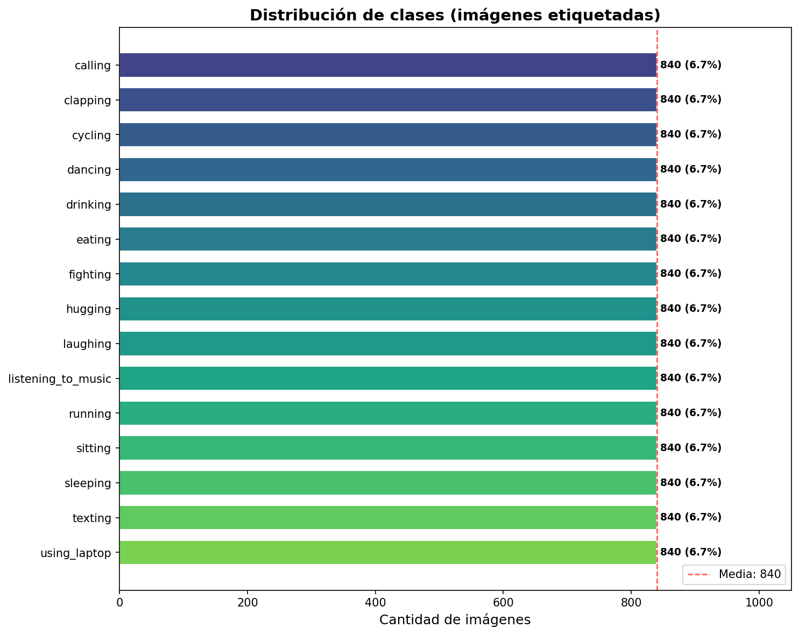
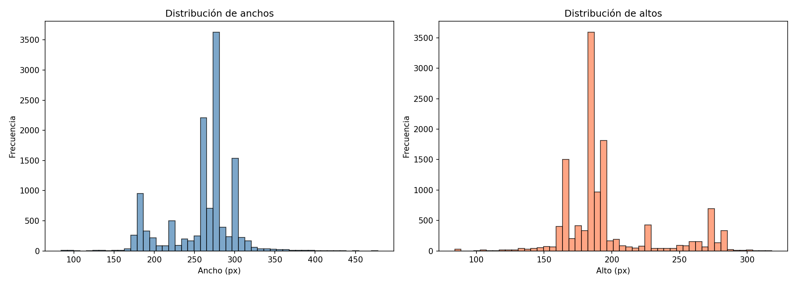
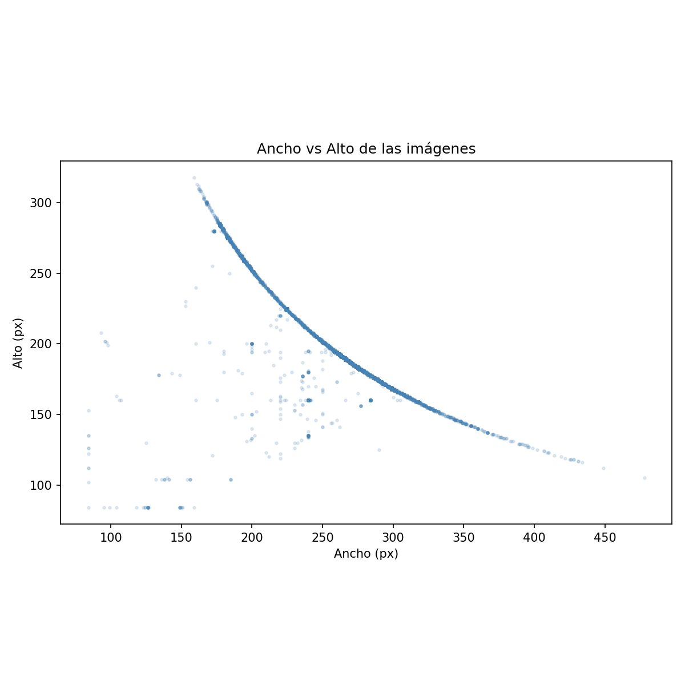

<div align="center">

# 🏃 Human Action Recognition (HAR) Dataset

### Descripción del Dataset

[](https://www.kaggle.com/datasets/meetnagadia/human-action-recognition-har-dataset)
[]()
[]()
[]()

</div>

---

## 📑 Índice

| # | Sección | Descripción |
|:-:|---------|-------------|
| 1 | [Información General](#-1-información-general) | Ficha técnica del dataset |
| 2 | [Origen y Descarga](#-2-origen-y-descarga) | De dónde proviene y cómo obtenerlo |
| 3 | [Estructura de Directorios](#-3-estructura-de-directorios) | Dónde se almacenan las imágenes |
| 4 | [Clases del Dataset](#-4-clases-del-dataset) | Las 15 actividades humanas |
| 5 | [Distribución de Clases](#-5-distribución-de-clases) | Balance y cantidad por clase |
| 6 | [Análisis de Tamaños](#-6-análisis-de-tamaños-de-imagen) | Resoluciones, formatos y modos de color |
| 7 | [Estadísticas RGB](#-7-estadísticas-de-canales-rgb) | Media y desviación estándar por canal |
| 8 | [Muestras Visuales](#-8-muestras-visuales-por-clase) | Ejemplos por cada clase |
| 9 | [Archivos CSV](#-9-archivos-csv) | Descripción de los metadatos |
| 10 | [Cómo ejecutar](#-10-cómo-ejecutar) | Instrucciones para reproducir el análisis |

---

## 📋 1. Información General

<table>
<tr><td><b>📦 Nombre</b></td><td>Human Action Recognition (HAR) Dataset</td></tr>
<tr><td><b>👤 Autor</b></td><td>Meet Nagadia</td></tr>
<tr><td><b>🌐 Plataforma</b></td><td><a href="https://www.kaggle.com/datasets/meetnagadia/human-action-recognition-har-dataset">Kaggle</a></td></tr>
<tr><td><b>📄 Licencia</b></td><td>Open Database License (ODbL)</td></tr>
<tr><td><b>💾 Tamaño</b></td><td>~328 MB</td></tr>
<tr><td><b>🖼️ Total imágenes</b></td><td>18,011 (12,601 etiquetadas + 5,410 sin etiqueta)</td></tr>
<tr><td><b>🎯 Tipo de tarea</b></td><td>Clasificación de imágenes (Computer Vision)</td></tr>
<tr><td><b>🏷️ Clases</b></td><td>15 actividades humanas</td></tr>
<tr><td><b>⚖️ Balance</b></td><td>Perfectamente balanceado (840 imágenes/clase)</td></tr>
</table>

El dataset contiene fotografías de personas realizando **15 actividades humanas diferentes** (llamar, aplaudir, andar en bicicleta, bailar, etc.). Estas imágenes son de resolución variada, en formato JPEG, y todas en modo RGB. El objetivo del dataset es servir como base para entrenar modelos de clasificación de imágenes mediante redes neuronales convolucionales (CNN).

---

## 📥 2. Origen y Descarga

El dataset fue publicado por **Meet Nagadia** en Kaggle, originalmente asociado al desafío *DPhi Data Sprint 76 - Human Activity Recognition*.

Se descarga automáticamente mediante la librería `kagglehub` con el parámetro `output_dir`, lo que permite almacenarlo directamente dentro de la carpeta del proyecto:

```
tp_ml/
└── datos_har/
    └── Human Action Recognition/
        ├── dataset/       (imágenes etiquetadas)
        ├── new_data/      (imágenes sin etiqueta)
        ├── dataset.csv
        └── new_data.csv
```

> 💡 Para descargar se requieren credenciales de Kaggle configuradas en `~/.kaggle/kaggle.json`.

---

## 📁 3. Estructura de Directorios

El script descarga el dataset dentro de `datos_har/` en la raíz del proyecto y renombra automáticamente las carpetas y archivos CSV originales:

| Original | Renombrado | Descripción |
|----------|------------|-------------|
| `train/` | **`dataset/`** | 12,601 imágenes JPEG etiquetadas vía CSV |
| `test/` | **`new_data/`** | 5,410 imágenes JPEG sin etiqueta |
| `Training_set.csv` | **`dataset.csv`** | Mapeo `filename → label` para dataset |
| `Testing_set.csv` | **`new_data.csv`** | Lista de filenames de new_data |

**Ubicación de las imágenes:**

- Las imágenes de **dataset** están almacenadas de forma **plana** (sin subcarpetas) dentro de `dataset/`. Cada archivo es un JPEG nombrado como `Image_1.jpg`, `Image_2.jpg`, etc. La etiqueta de cada imagen se obtiene del archivo `dataset.csv`.
- Las imágenes de **new_data** están igualmente almacenadas de forma plana dentro de `new_data/`, sin etiquetas asociadas.

> 📌 El script `data_explore.py` unifica ambas carpetas copiando las imágenes de `new_data/` dentro de `dataset/`, generando un único directorio con **12,611 imágenes** para que luego un script de particionado pueda dividir train/val/test de forma controlada.

---

## 🏷️ 4. Clases del Dataset

El dataset define **15 clases** de actividades humanas:

| # | Clase | | Descripción |
|:-:|-------|:-----:|-------------|
| 1 | `calling` | 📞 | Persona hablando por teléfono |
| 2 | `clapping` | 👏 | Persona aplaudiendo |
| 3 | `cycling` | 🚴 | Persona andando en bicicleta |
| 4 | `dancing` | 💃 | Persona bailando |
| 5 | `drinking` | 🥤 | Persona bebiendo |
| 6 | `eating` | 🍽️ | Persona comiendo |
| 7 | `fighting` | 🤼 | Personas peleando |
| 8 | `hugging` | 🤗 | Personas abrazándose |
| 9 | `laughing` | 😂 | Persona riendo |
| 10 | `listening_to_music` | 🎧 | Persona escuchando música |
| 11 | `running` | 🏃 | Persona corriendo |
| 12 | `sitting` | 🪑 | Persona sentada |
| 13 | `sleeping` | 😴 | Persona durmiendo |
| 14 | `texting` | 📱 | Persona escribiendo en el celular |
| 15 | `using_laptop` | 💻 | Persona usando una laptop |

Cada clase contiene **840 imágenes etiquetadas** en el conjunto de entrenamiento original.

---

## 📊 5. Distribución de Clases

El dataset etiquetado contiene **12,600 imágenes** distribuidas equitativamente entre las 15 clases (**840 imágenes por clase**). Tras la unificación con `new_data/`, la carpeta `dataset/` totaliza **12,611 imágenes**.

<div align="center">



</div>

**Métricas de balance:**

| Métrica | Valor |
|---------|:-----:|
| Total imágenes etiquetadas | 12,600 |
| Imágenes por clase | 840 |
| Clases | 15 |
| Ratio max/min entre clases | 1.00 |
| Desviación estándar entre clases | 0.00 |
| **Balance** | ✅ **Perfectamente balanceado** |

> El dataset está perfectamente balanceado: todas las clases tienen exactamente la misma cantidad de imágenes. Esto elimina la necesidad de técnicas de balanceo como oversampling, undersampling o class weights durante el entrenamiento.

---

## 📐 6. Análisis de Tamaños de Imagen

Las **12,611 imágenes unificadas** del dataset son **JPEG** en modo **RGB** (3 canales). Sin embargo, las resoluciones son **variadas**:

| Propiedad | Mínimo | Máximo | Promedio |
|-----------|:------:|:------:|:--------:|
| **Ancho (px)** | 84 | 478 | ~260 |
| **Alto (px)** | 84 | 318 | ~197 |

Se encontraron **542 resoluciones únicas**. Las más frecuentes:

| Resolución | Cantidad | % del total |
|:----------:|:--------:|:-----------:|
| 275×183 | 3,051 | 24.2% |
| 300×168 | 1,036 | 8.2% |
| 183×275 | 637 | 5.1% |
| 259×194 | 614 | 4.9% |

<div align="center">





</div>

> ⚠️ Dado que las imágenes tienen tamaños variados, será necesario aplicar **redimensionado (resize)** a una resolución uniforme antes de alimentar un modelo (por ejemplo, 224×224 para arquitecturas estándar).

---

## 🎨 7. Estadísticas de Canales RGB

Calculadas sobre una muestra aleatoria de **2,000 imágenes** (valores normalizados entre 0 y 1):

| Métrica | Canal R | Canal G | Canal B |
|---------|:-------:|:-------:|:-------:|
| **Media** | 0.5713 | 0.5357 | 0.5040 |
| **Desviación Estándar** | 0.3080 | 0.3037 | 0.3106 |

Estos valores permiten aplicar **normalización** al preprocesar las imágenes para el modelo:

```python
transforms.Normalize(
    mean=[0.5713, 0.5357, 0.5040],
    std=[0.3080, 0.3037, 0.3106]
)
```

> 💡 La media cercana a 0.5 en los tres canales indica imágenes con brillo medio. La desviación estándar (~0.31) muestra buena variabilidad tonal.

---

## 🖼️ 8. Muestras Visuales por Clase

A continuación se muestran **3 imágenes de ejemplo por cada una de las 15 clases**, que permiten verificar visualmente la coherencia de las etiquetas, la variabilidad dentro de cada clase y la calidad general de las imágenes:

<div align="center">


</div>

---

## 📄 9. Archivos CSV

El dataset incluye dos archivos CSV (renombrados por el script) que contienen los metadatos de las imágenes:

### `dataset.csv`

| Columna | Tipo | Descripción |
|---------|------|-------------|
| `filename` | string | Nombre del archivo de imagen (ej: `Image_1.jpg`) |
| `label` | string | Etiqueta de la actividad humana (ej: `calling`, `dancing`) |

- **Filas:** 12,600 (una por cada imagen etiquetada)
- **Uso:** Es el archivo principal de etiquetas. Cada fila asocia un nombre de archivo de imagen con su clase correspondiente. Este CSV es necesario porque las imágenes están almacenadas de forma plana en `dataset/` sin subcarpetas por clase.

### `new_data.csv`

| Columna | Tipo | Descripción |
|---------|------|-------------|
| `filename` | string | Nombre del archivo de imagen (ej: `Image_1.jpg`) |

- **Filas:** 5,400
- **Uso:** Lista los nombres de las imágenes sin etiqueta. Originalmente pensado para generar predicciones en una competencia (Data Sprint 76). No contiene etiquetas.

---

## ▶️ 10. Cómo ejecutar

El análisis de este documento fue generado mediante el script `data_explore.py`. Para reproducirlo:

```powershell
# Desde la raíz del proyecto (tp_ml/)

# 1. Activar el entorno virtual
.\tp_ml_env\Scripts\Activate.ps1

# 2. Ejecutar el script de exploración
python data_prep/data_explore.py
```

El script realiza las siguientes acciones:
1. Carga el dataset desde `datos_har/` (lo descarga desde Kaggle si no existe)
2. Analiza la estructura de directorios y archivos CSV
3. Copia las imágenes de `new_data/` a `dataset/` para unificar el dataset
4. Calcula y grafica la distribución de clases con métricas de balance
5. Analiza tamaños, resoluciones y formatos de las imágenes
6. Calcula estadísticas de canales RGB (media y desviación estándar)
7. Genera una grilla visual con muestras de cada clase

Los gráficos generados se guardan en `data_prep/output/`.

---

<div align="center">

*Documento generado como parte del TP de Machine Learning — Exploración del dataset HAR*

</div>
