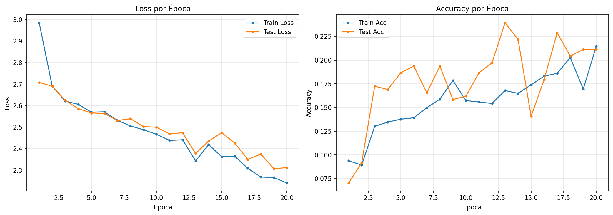
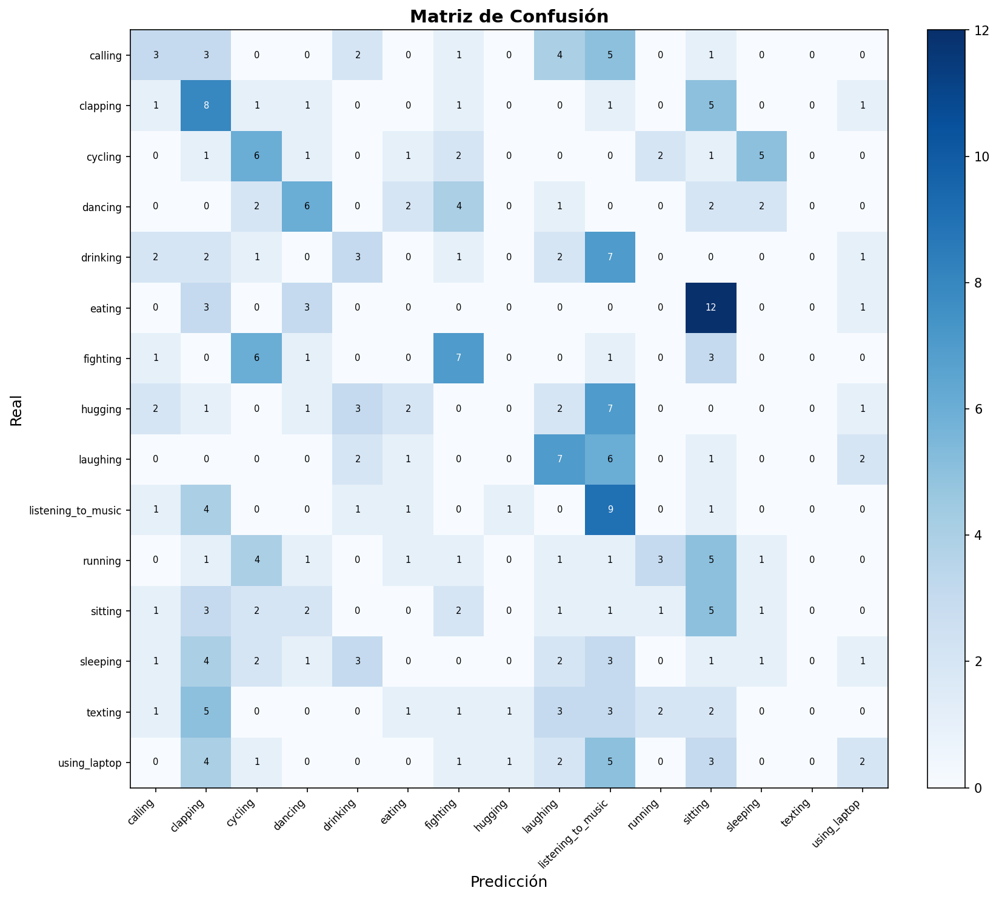

# Resultados del Entrenamiento — ResNet50 Transfer Learning V2, 2 Fases (HAR)


-green)
-orange)


---

## Índice

| # | Sección |
|---|---------|
| 1 | [Objetivo](#1-objetivo) |
| 2 | [Dataset](#2-dataset) |
| 3 | [Arquitectura del Modelo](#3-arquitectura-del-modelo) |
| 4 | [Hiperparámetros](#4-hiperparámetros) |
| 5 | [Resultados](#5-resultados) |
| 6 | [Curvas de Entrenamiento](#6-curvas-de-entrenamiento) |
| 7 | [Matriz de Confusión](#7-matriz-de-confusión) |
| 8 | [Reporte de Clasificación](#8-reporte-de-clasificación) |
| 9 | [Análisis](#9-análisis) |

---

## 1. Objetivo

Entrenar un modelo de clasificación de imágenes basado en **transfer learning** (ResNet50 pretrained en ImageNet V2) para el dataset HAR (Human Activity Recognition) con 15 clases de actividad humana. Se utiliza semilla fija (`SEED=42`) para reproducibilidad.

## 2. Dataset

| Parámetro | Valor |
|-----------|-------|
| Imágenes totales | 12,570 (838 por clase, balanceado con oversampling) |
| Tamaño en disco | 256 × 192 px |
| Preprocesamiento | Resize → CLAHE (LAB) → RGB |
| Canales | 3 (RGB) |
| Tamaño de entrada al modelo | 320 × 240 px (mayor resolución para capturar detalle) |
| Split train/test | 80% / 20% (estratificado) |
| Train | 10,056 imágenes |
| Test | 2,514 imágenes |

**Clases (15):** calling, clapping, cycling, dancing, drinking, eating, fighting, hugging, laughing, listening_to_music, running, sitting, sleeping, texting, using_laptop.

## 3. Arquitectura del Modelo

```
ResNet50 (Transfer Learning)
  backbone: ResNet50 pretrained en ImageNet1K_V2
    conv1 → bn1 → relu → maxpool
    layer1 (3 Bottleneck)  [256 filtros]
    layer2 (4 Bottleneck)  [512 filtros]
    layer3 (6 Bottleneck)  [1024 filtros]
    layer4 (3 Bottleneck)  [2048 filtros]
    avgpool: AdaptiveAvgPool2d(1,1)  [2048×1×1]
  fc (head custom):
    Linear(2048→256) → ReLU → Dropout(0.3) → Linear(256→15)
```

| Parámetro | Valor |
|-----------|-------|
| Parámetros totales | ~24,557,839 |
| Fase 1 (head) | ~528,655 entrenables (backbone congelado) |
| Fase 2 (completo) | ~24,557,839 entrenables |
| Pesos pretrained | ImageNet1K_V2 |
| Canal de entrada | 3 (RGB) |
| Device | CPU / GPU (Colab) |

## 4. Hiperparámetros

| Hiperparámetro | Valor |
|----------------|-------|
| Estrategia | 2 fases (head → progressive unfreezing) |
| Fase 1 épocas | 10 (backbone congelado) |
| Fase 2 épocas máx. | 100 (early stopping) |
| Progressive unfreezing | F2 épocas 1-10: layer3+layer4+fc; época 11+: todo |
| Batch size | 64 (script) / 128 (Colab) |
| LR head | 1e-3 |
| LR backbone (fase 2) | 5e-5 |
| Weight decay | 1e-3 |
| Optimizador | AdamW |
| Scheduler (fase 2) | SequentialLR (LinearLR warmup 5ep + CosineAnnealingLR) |
| Early stopping | Paciencia 10 épocas |
| Loss | CrossEntropyLoss (label_smoothing=0.05) |
| Gradient clipping | max_norm=1.0 |
| Dropout | 0.3 |
| MixUp/CutMix | Desactivado (AUGMIX_PROB=0.0) |
| Semilla | 42 |

**Data Augmentation agresiva (solo train):**
- Resize(320, 240)
- RandomHorizontalFlip (p=0.5)
- RandomRotation (20°)
- ColorJitter (brightness=0.3, contrast=0.3, saturation=0.3, hue=0.1)
- RandAugment (num_ops=2, magnitude=6)
- RandomErasing (p=0.10)
- Normalize ImageNet (mean=[0.485, 0.456, 0.406], std=[0.229, 0.224, 0.225])

> **Nota Colab (`train_cnn_colab.ipynb`):** batch\_size=128, NUM\_WORKERS=2, AMP (float16), torch.compile, pin\_memory. Mismos hiperparámetros de modelo y augmentation.

## 5. Resultados

> ⏳ Pendiente — ejecutar `train_cnn.py` para obtener resultados con la nueva configuración.

## 6. Curvas de Entrenamiento



> Se actualizará tras el próximo entrenamiento.

## 7. Matriz de Confusión



> Se actualizará tras el próximo entrenamiento.

## 8. Reporte de Clasificación

> ⏳ Pendiente — se actualizará tras el próximo entrenamiento.

## 9. Análisis

**Configuración actual (ResNet50 Transfer Learning V2 — 2 fases):**

- **Transfer Learning**: ResNet50 pretrained en ImageNet V2 (receta de entrenamiento moderna, mejor accuracy base)
- **Entrenamiento en 2 fases**: Fase 1 congela backbone y entrena solo el head → Fase 2 fine-tuning completo con LR diferencial
- **Mayor capacidad**: ~24.6M parámetros (ResNet50 vs ResNet18 anterior)
- **Resolución**: 320×240 (mayor resolución para capturar más detalle)
- **Normalización ImageNet**: mean/std alineados con los pesos pretrained
- **Progressive unfreezing**: F2 épocas 1-10 solo layer3+layer4+fc; época 11+ todo
- **Augmentation moderada**: ColorJitter + RandAugment(mag=6) + RandomErasing(0.10)
- **MixUp/CutMix**: desactivado (AUGMIX_PROB=0.0, no beneficia con 15 clases y 12K imágenes)
- **Label smoothing (0.05)**: regularización suave conservadora
- **Gradient clipping (1.0)**: estabilidad con AMP (mixed precision)
- **Regularización moderada**: Dropout 0.3, weight_decay 1e-3
- **LR diferencial**: backbone lr=5e-5 (ajuste más agresivo), head lr=1e-3 (F1) / 1e-4 (F2)
- **Warmup lineal**: 5 épocas para estabilizar gradientes al descongelar backbone
- **Early stopping por loss**: paciencia 10 épocas
- **Dataset**: 12,570 imágenes RGB con CLAHE, balanceadas a 838/clase
