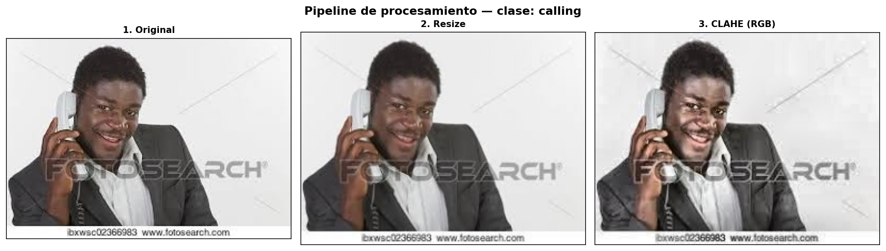
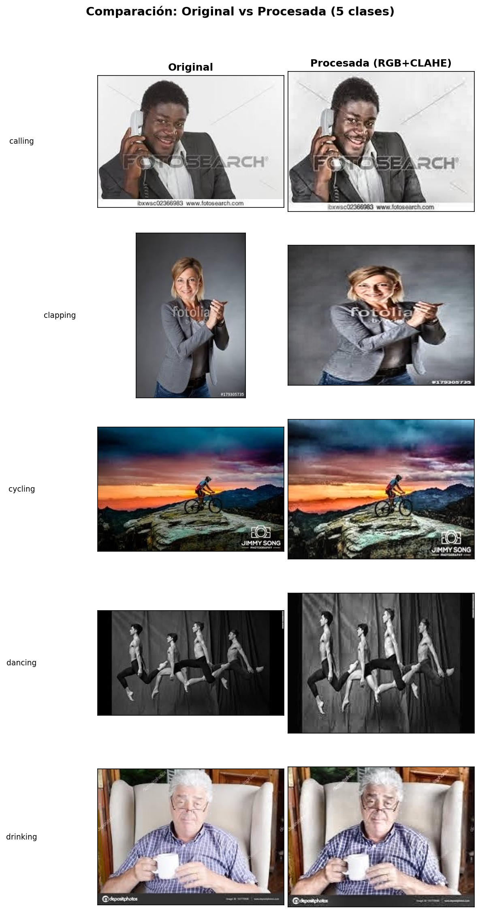

<div align="center">

# 🔧 Adecuación de Imágenes — Dataset HAR

### Transformación y normalización del dataset

[]()
[]()
[]()
[]()

</div>

---

## 📑 Índice

| # | Sección | Descripción |
|:-:|---------|-------------|
| 1 | [Objetivo](#-1-objetivo) | Qué hace este script |
| 2 | [Tamaño objetivo](#-2-tamaño-objetivo) | Cálculo del tamaño estándar |
| 3 | [Filtrado por tamaño](#-3-filtrado-por-tamaño) | Descarte de imágenes muy pequeñas |
| 4 | [Balance de clases](#-4-balance-de-clases) | Oversampling para equilibrar clases |
| 5 | [Pipeline de procesamiento](#-5-pipeline-de-procesamiento) | Resize + CLAHE (LAB) + RGB |
| 6 | [Ejemplos visuales](#-6-ejemplos-visuales) | Antes vs después, pipeline paso a paso |
| 7 | [Resultados](#-7-resultados) | Resumen numérico |
| 8 | [Cómo ejecutar](#-8-cómo-ejecutar) | Instrucciones de ejecución |

---

## 🎯 1. Objetivo

El script `data_adecuate.py` toma las imágenes originales del dataset HAR (`datos_har/dataset/`) y genera una versión procesada en `datos_har/dataset_tr/`, aplicando:

1. **Redimensionado** a un tamaño estándar uniforme (promedio redondeado a múltiplo de 32)
2. **Filtrado**: se descartan imágenes menores al umbral mínimo (128×128)
3. **Oversampling** con reemplazo para igualar todas las clases a la más numerosa
4. **CLAHE** (Contrast Limited Adaptive Histogram Equalization) en espacio LAB
5. **Guardado en RGB** (3 canales) para preservar la información de color

---

## 📐 2. Tamaño objetivo

Se calculó el **tamaño promedio** de todas las 12,600 imágenes etiquetadas:

| Dimensión | Promedio real | Estándar más cercano (múltiplo de 32) |
|:---------:|:------------:|:-------------------------------------:|
| **Ancho** | 260.4 px | **256 px** |
| **Alto** | 196.6 px | **192 px** |

> El tamaño objetivo resultante es **256 × 192 píxeles**.

---

## 🔍 3. Filtrado por tamaño

Se descartan todas las imágenes cuyo ancho **o** alto sea menor al umbral mínimo (128×128). Esto permite incluir la mayoría de imágenes del dataset, aceptando tanto downscale como upscale moderado.

| Métrica | Valor |
|---------|:-----:|
| Imágenes totales | 12,600 |
| Imágenes válidas (≥ 128×128) | 12,510 |
| Imágenes descartadas | 90 (0.7%) |

**Distribución por clase después del filtrado:**

| Clase | Imágenes válidas |
|-------|:----------------:|
| calling | 837 |
| clapping | 836 |
| cycling | 837 |
| dancing | 833 |
| drinking | 836 |
| eating | 835 |
| fighting | 834 |
| hugging | 837 |
| laughing | 838 |
| listening_to_music | 835 |
| running | 822 |
| sitting | 833 |
| sleeping | 834 |
| texting | 827 |
| using_laptop | 836 |

---

## ⚖️ 4. Balance de clases

Tras el filtrado, las clases quedan desbalanceadas. Para mantener el equilibrio, se realiza **oversampling con reemplazo** (seed=42) igualando todas las clases a la clase con más imágenes.

| Métrica | Valor |
|---------|:-----:|
| Clase con más imágenes | `laughing` (838) |
| Imágenes por clase (post-balance) | **838** |
| Total imágenes procesadas | **12,570** (838 × 15) |

---

## ⚙️ 5. Pipeline de procesamiento

Cada imagen pasa por 3 etapas secuenciales:

### 5.1 Redimensionado (Resize)

```
Tamaño variable → 256 × 192 px
Interpolación adaptativa:
  - cv2.INTER_CUBIC para upscale (imágenes más chicas que el objetivo)
  - cv2.INTER_AREA para downscale (imágenes más grandes que el objetivo)
```

### 5.2 CLAHE (Contrast Limited Adaptive Histogram Equalization)

```python
clahe = cv2.createCLAHE(clipLimit=2.0, tileGridSize=(8, 8))
```

- Se convierte la imagen a espacio de color **LAB**
- Se aplica CLAHE solo al **canal L** (luminancia)
- Se reconstruye la imagen LAB → BGR
- Mejora el contraste local sin amplificar ruido excesivo
- La imagen se mantiene en **RGB (3 canales)** para preservar la información de color

### 5.3 Guardado

- Se guarda cada imagen procesada como archivo individual en `datos_har/dataset_tr/`
- Para duplicados de oversampling se genera un nombre único con sufijo `_dupN`

<div align="center">



</div>

---

## 🖼️ 6. Ejemplos visuales

Comparación lado a lado de imágenes originales vs procesadas para 5 clases:

<div align="center">



</div>

---

## 📊 7. Resultados

| Métrica | Valor |
|---------|:-----:|
| Tamaño objetivo | 256 × 192 px |
| Umbral mínimo | 128 × 128 px |
| Imágenes originales | 12,600 |
| Descartadas (menor a umbral) | 90 |
| Post-oversampling por clase | 838 |
| **Total procesadas** | **12,570** |
| Clases | 15 |
| Carpeta de salida | `datos_har/dataset_tr/` |
| Formato de salida | RGB (3 canales) |

---

## ▶️ 8. Cómo ejecutar

```powershell
# Desde la raíz del proyecto (tp_ml/)
.\tp_ml_env\Scripts\Activate.ps1
python data_trans/data_adecuate.py
```

**Requisitos:** `opencv-python-headless`, `numpy`, `pandas`, `Pillow`, `tqdm`, `matplotlib`

Las imágenes procesadas se guardan en `datos_har/dataset_tr/` y los gráficos de ejemplo en `data_trans/output/`.

---

<div align="center">

*Documento generado como parte del TP de Machine Learning — Adecuación del dataset HAR*

</div>
